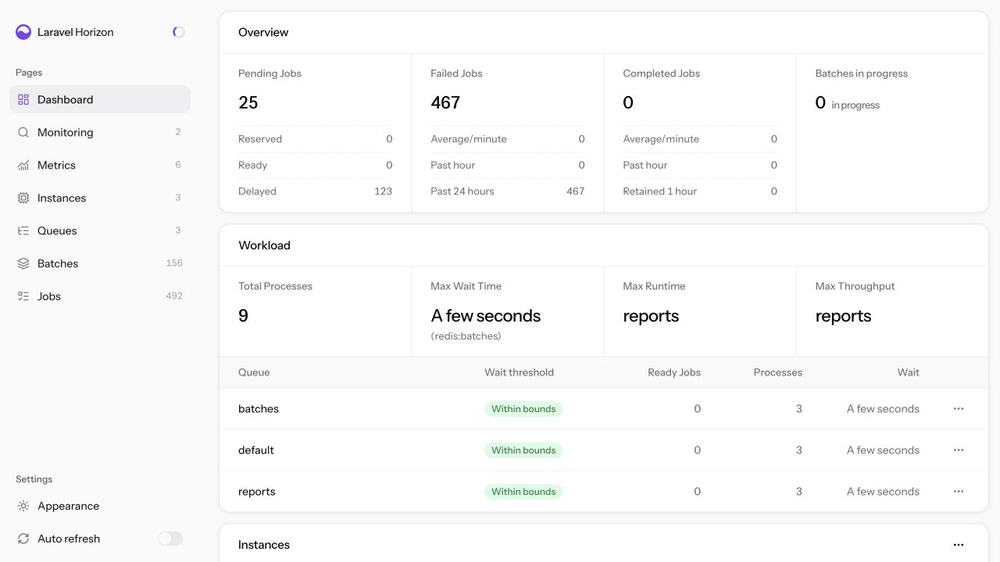

# Horizon New Dawn

> [!WARNING]
> Horizon New Dawn is a young project and is not ready for production. Expect breaking changes and use it only in development or testing environments for now.

Horizon New Dawn replaces Laravel Horizon's bundled interface with a package-owned React 19 and Inertia 3 application while keeping Horizon's authorization, repositories, metrics, and queue workers in charge.

The package reads Horizon data in PHP and sends structured page props through Inertia. It does not add a second browser-facing API layer, and it leaves Horizon's existing API controllers untouched.



## Beyond the original Horizon interface

Compared with Horizon's bundled interface, New Dawn adds:

- advanced job and batch filtering, including job class, queue, connection, tag, pending state, retry status, batch status, and creation date;
- Horizon instance management, with controls to pause or continue individual local instances and terminate local instances;
- supervisor controls and detailed configuration views covering scaling, balancing, process limits, memory, timeouts, retries, backoff, and configuration warnings;
- queue management, including timed or indefinite pauses, resuming, clearing one or all queues, and retrying failures for a specific queue;
- individual and bulk cancellation of eligible pending jobs, while protecting batched jobs so they are cancelled through their batch;
- bulk and scoped failure recovery, with controls to retry or remove one failed job, retry or clear all failures, and retry failures by queue, monitored tag, or batch;
- batch management, including cancelling active batches, retrying failed batch jobs, clearing retained failures, and clearing finished batches.

## Requirements

- PHP 8.3 or newer
- Laravel 12.38 or newer, or Laravel 13
- Laravel Horizon 5.46.0 or newer within the 5.x series

These floors are deliberate:

- PHP 8.3 is the lowest PHP version covered by the package's release matrix. New Dawn does not claim compatibility with runtimes it does not continuously test.
- Laravel 12.38 contains the framework fix needed to register console commands correctly with current Symfony Console releases. Earlier Laravel 12 releases can fail while booting Artisan. Laravel 11 is excluded because it is end-of-life.
- Horizon 5.46.0 is the oldest Horizon release exercised by New Dawn's full package suite, real Redis worker smoke test, and consuming-application browser checks. Older Horizon releases are not part of the supported contract.

Queue pausing is available when the installed Laravel version provides its complete queue-pause API (Laravel 12.40.2 or newer). On Laravel 12.38 through 12.40.1, New Dawn hides only the unsupported pause and resume controls; retrying failures and clearing queues remain available.

Redis Cluster is not currently supported. Queue metadata cleanup uses Redis key scans and Lua operations that have not yet been made cluster-slot aware, so Horizon and its queues must use a standalone Redis connection.

## Installation

Install and configure Laravel Horizon in the host application first. Then install New Dawn and publish its compiled assets:

```bash
composer require nckrtl/horizon-new-dawn:^0.1.0
php artisan horizon-new-dawn:install
```

Visit the host application's existing Horizon path, which is `/horizon` by default. New Dawn honors Horizon's configured path and domain and uses Horizon's existing authorization callback and middleware.

When updating the package, refresh the published assets:

```bash
php artisan horizon-new-dawn:install --force
```

No Node.js or frontend build is required in the consuming application.

## Trying it safely

Use New Dawn in a disposable development or testing environment first. Its interface includes actions that mutate Horizon and Redis state, such as cancelling jobs, clearing queues and failures, retrying work, and terminating Horizon instances. Do not point an evaluation install at production queues.

New Dawn uses Horizon's existing authorization callback and middleware. Before exposing the dashboard outside a local environment, verify that your application's Horizon authorization gate admits only trusted operators.

If the application caches routes or configuration, clear those caches after installing or updating:

```bash
php artisan optimize:clear
```

To populate the metrics pages, schedule Horizon's snapshot command every five minutes in the host application's `routes/console.php`:

```php
use Illuminate\Support\Facades\Schedule;

Schedule::command('horizon:snapshot')->everyFiveMinutes();
```

## Reverting to the original Horizon interface

Remove Horizon New Dawn, reinstall Horizon's resources, and clear the application's cached configuration and routes:

```bash
composer remove nckrtl/horizon-new-dawn
php artisan horizon:install
php artisan optimize:clear
```

The original Horizon interface will then be available at the application's existing Horizon path. Current Horizon releases load their compiled interface assets directly from the `laravel/horizon` package, so the deprecated `horizon:publish` command is not required.

## Interface

New Dawn provides dedicated Inertia routes for:

- the dashboard, system status, supervisors, workload, throughput, wait times, and recent failures;
- pending, completed, silenced, and failed job lists with job detail pages;
- retrying one failed job or all failed jobs;
- monitored tags with completed and failed job views;
- job and queue metrics with historical snapshots;
- job batches, batch search, batch progress, failed jobs, and batch retry.

The interface uses a persistent responsive layout composed from shadcn/ui primitives. It supports light, dark, and system themes; sortable data tables; Inertia-powered infinite scrolling backed by Horizon cursors; optional automatic refreshes; responsive navigation; and Inertia mutations with toast feedback. Generated Wayfinder routes are rebased at runtime, so links and actions continue to work with a custom Horizon path or an absolute domain URL.

Horizon API routes remain available and unchanged. Unsupported legacy UI paths return `404` instead of silently falling back to Horizon's Vue application.

## Configuration

Publish the configuration when you need to change defaults:

```bash
php artisan vendor:publish --tag=horizon-new-dawn-config
```

```php
return [
    'assets_path' => 'vendor/horizon-new-dawn/build',
    'poll_interval' => 5000,
    'recent_failures_limit' => 5,
];
```

## Development

```bash
composer install
bun install
php vendor/bin/testbench workbench:build
composer quality
bun run format:check
bun run lint
bun run test
bun run typecheck
bun run build
```

Regenerate typed Horizon route helpers after route changes:

```bash
bun run wayfinder:generate
```

The package includes an Orchestra Workbench application with deterministic successful and failing queue jobs for exercising the interface.

## License

Horizon New Dawn is open-source software licensed under the MIT license.
